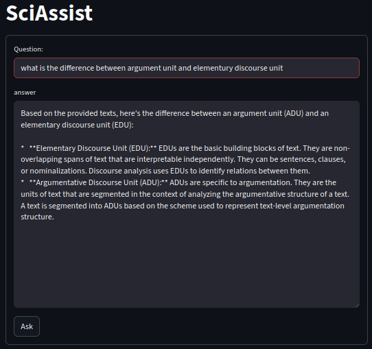

# SciAssist

This is a research assistant for NLP Researchers that is implemented using Retrieval Augmented Generation. It uses
DeepSeek-R1-Distill-Qwen-1.5B as a backbone to answer questions on scientific NLP Papers. The paper pool that the underlines 
the rag system contains 72k papers from the [ACL Anthology](https://github.com/shauryr/ACL-anthology-corpus?tab=readme-ov-file).


# Deployment


### Locally using CLI
To deploy the Retrieval Augmented Generation pipeline via clli which allows you to chat with the interface via command line you 
can run the following

```
python scirag/setup_rag.py --debug --path-index data/index --path-dataset data/acl-publication-info.74k.parquet
  --path-model /bigwork/nhwpajjy/pre-trained-models/DeepSeek-R1-Distill-Qwen-1.5B
```

adding debug will create an index of only 100 papers for debugging purposes

### Locally as a web service on cpu

```
./run_server.sh
```

### Locally as a webservice using docker
```
./scirag/deploy_sciarg_cpu.sh
```

The web service can be then accessed as follows 
```
http://127.0.0.1:80/chat?q= What are typical software designs of RAG   
```

or using curl 
```
curl curl http://127.0.0.1:80/chat?q=aaa
```

### AWS
```
1) you can start an EC2 instance g4dn.xlarge.
2) docker run -it --rm --gpus all -p 80:80 --name "sciassist-cnt" --tty "yamenajjour:/sciassist-img:17"

```

### Chat UI Client

The chat ui client is implemented using streamlit and is deployed as a single docker container

to build run the following

### Locally as a web service

```
./run_client.sh
```


```
docker build -t sciassist-client -f chatui/docker/Dockerfile .
```

To run the client use
```
docker run  -p 8081:8051 sciassist-client
```

Then you should be able to access the web client using 127.0.0.1:8501
